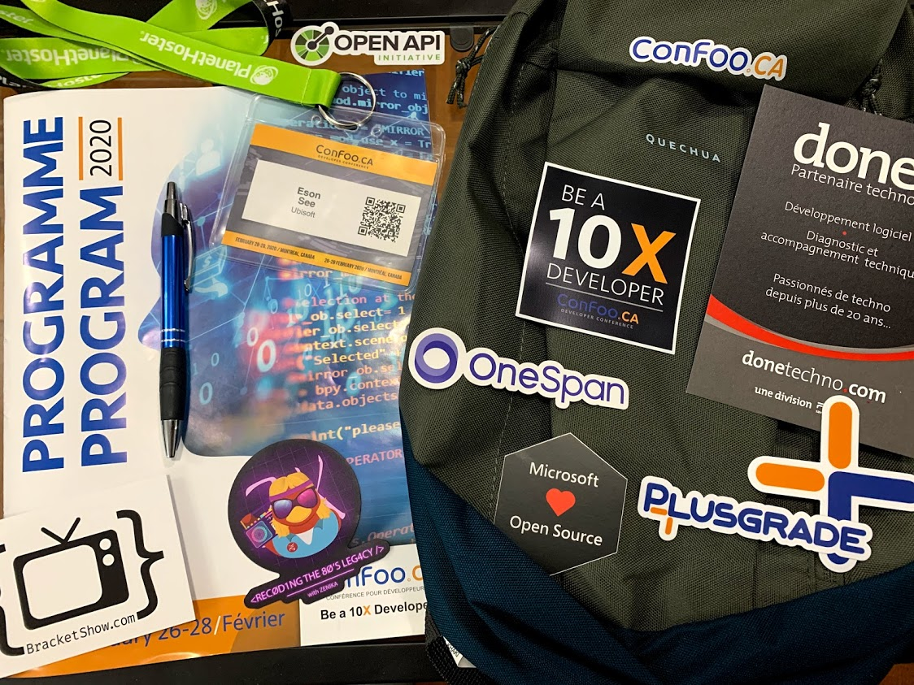
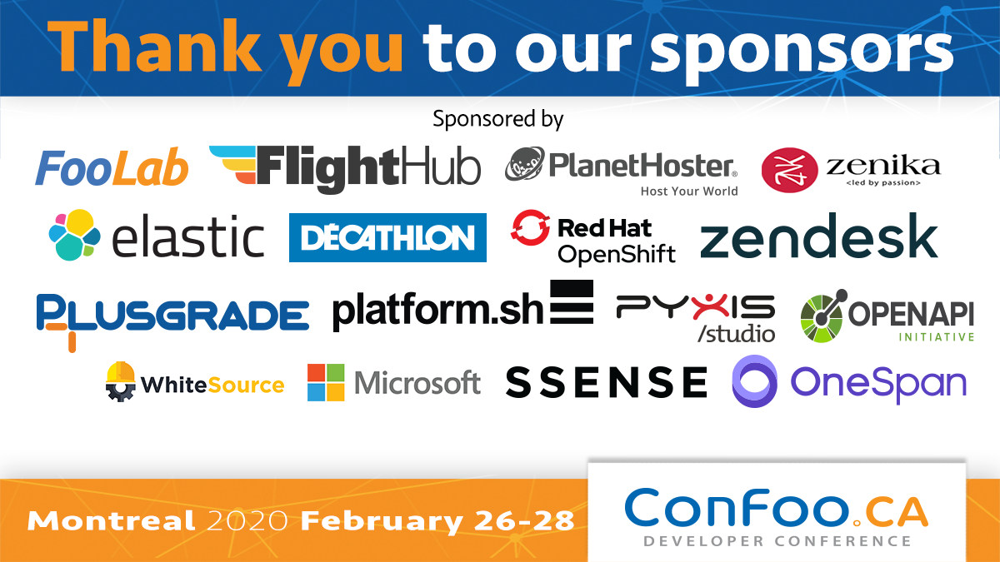

I've had the opportunity to attend [ConFoo Montreal 2020](https://confoo.ca/en/yul2020/) at Hotel Bonaventure Montréal this week.


### What is ConFoo?

[ConFoo](https://confoo.ca/) is a nonprofit organization founded by [Yann Larrivée](https://twitter.com/ylarrivee). In 18 years, the event has evolved from a PHP conference to include all web technologies and related topics. 

All the topics this year are listed [here](https://confoo.ca/en/yul2020/schedule) and the presentation slides were uploaded by the organizer at this Github repository: [https://github.com/confooca/yul2020-slides](https://github.com/confooca/yul2020-slides) :heart_eyes:

### The Presentations

The presentation on Go and Kubernetes were most related to my current job, and they were super popular with the rooms fully packed. Sadly there was only one single session on Go.

It was also nice to see some cool things in Python 3 since I've been coding using Python 2.7 for the past 3 years. Even though the chance of me switching to Python 3 at work remains low.

For historical reason, the conference is mostly on web technologies with a lot of them on PHP (which I didn't attend any). Besides those, there were many talks on various JavaScript topics. It's interesting to know that we now have browser API to get battery status and connect to Bluetooth devices; you can also build an indie platformer game (like [Celeste](http://www.celestegame.com/)) running at 60fps and publish on Steam.

[Flutter](https://flutter.dev/) from Google looks promising and I am eager to try it out. It looks like an attempt from Google to promote [Dart](https://dart.dev/).

### The Swag (Stuff We All Get)
Every participant get a goodie bag with some stickers and magnets in it.

Of course, food, drinks and lots of coffee :coffee: to keep us awake


... plus community cocktail :beers: with retro games :video_game: after a long day.



Thank you Confoo, the event sponsors, and my employer for sending me to attend. Until next time!

