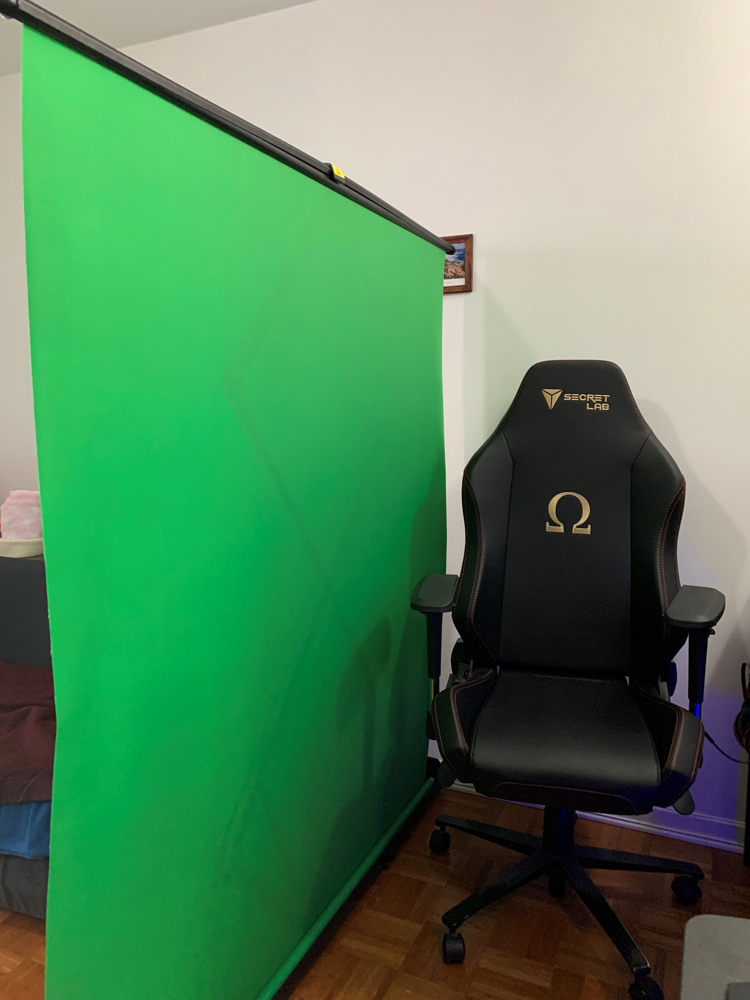
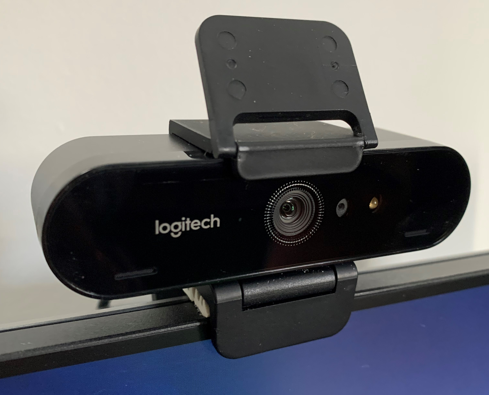
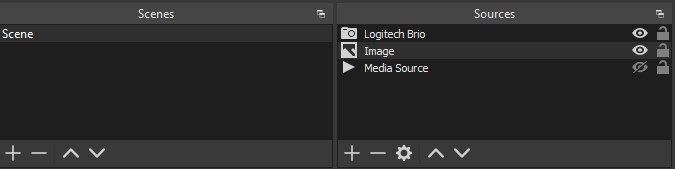
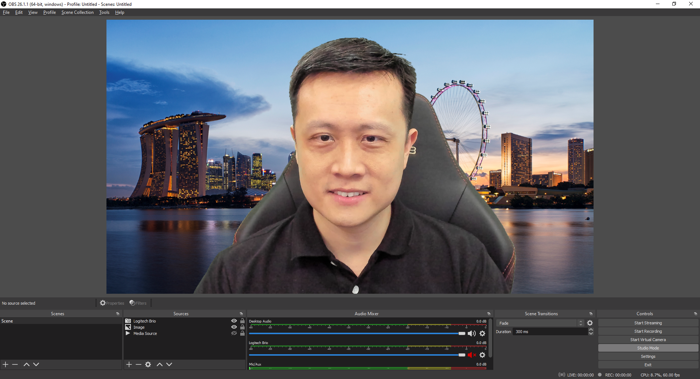
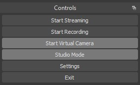
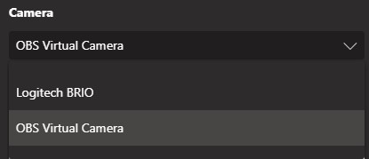

Working from home has become the *new normal* as the global COVID-19 pandemic situation continues. Apart from work, we are also using video calls more and more to stay in touch with friends and family.

Joining work meetings with webcam on is becoming normal and it certainly helps with communication - facial expression, body language, nodding and other visual cues are helpful apart from voice. It is also pleasing to see the faces of co-workers whom we haven't met in person for a long time.

However, not everyone has a nice background and we also want to protect the privacy of our family members at home. Most video call applications (such as Microsoft Teams or Zoom) provide virtual backgrounds, or the ability to blur your background. Depending on your webcam and the actual environment, the effect might or might not be satisfactory.

I decided to buy a [collapsible Chromakey background](https://www.amazon.ca/gp/product/B086VYJ188/) (green screen) so that I can *play* with OBS Virtual Camera and still be able to store the green screen to save space.

To improve video quality, I've also upgraded to a [Logitech Brio](https://www.logitech.com/en-ca/products/webcams/brio-4k-hdr-webcam.960-001105.html), and I'm very happy with the image quality. (It also comes with an attachable privacy shutter)

Furthermore, this is also one of the few webcams which support Windows Hello Face sign in. See how it works:


 
To make use of the green screen, I use OBS Virtual Camera like most people. You can find a lot of tutorials online with details. I'll do a quick run-down here with my personal setup.

First of all, with the webcam already added as a "Video Capture Device" in OBS, simply add a "Chroma Key" filter to the camera. The green screen is visible when the filter is hidden.


 
Next, add an image or media source (video) to the scene in OBS and they will be displayed within the chromakey area.

How it looks with a static image (of Singapore :singapore:):

For some extra fun, download a loopable short video online and let it play in loop:


 
With everything setup, simply click Start Virtual Camera under the Controls.

Back in the video call application (Teams in this example), select "OBS Virutal Camera" instead of Logitech Brio:

