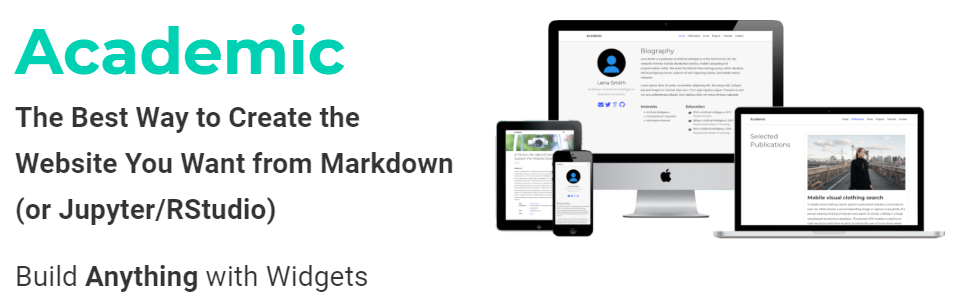

Hello and welcome! You probably found this website from my [LinkedIn](https://www.linkedin.com/in/esonsee) or other social media profiles.

### Why eson.dev?

For years, I have always wanted to own a personal website. Back when I was living in Singapore, I even reserved the hostname `eson.sg` for many years without hosting anything :sweat_smile:. I was still building up my career and LinkedIn is the best place to display my skills and experience.

In 2019, I found that `.dev` has become a top-level domain, as [announced by Google](https://www.blog.google/technology/developers/hello-dev/). A quick search showed that `eson.dev` is still available and I purchased the domain in no time. I wanted to use it as an alternative to my LinkedIn profile and give it a more personal touch, to showcase my experience and game projects, and maybe write some articles to share some tips and tricks.

### Deciding the tech to use

After owning the domain name, it was time to decide on the technology to build the site on. A long time ago, I learnt website building with just HTML and JavaScript using [Microsoft FrontPage](https://en.wikipedia.org/wiki/Microsoft_FrontPage) (it was also a period when [Flash](https://en.wikipedia.org/wiki/Adobe_Flash) was prominent) :joy:. Of course, we are living in 2020 now and there are so many ways to create your own website without even writing a single line of HTML.

I tried out with the GitHub's own [personal-website](https://github.com/github/personal-website) project. It uses [Jekyll](https://jekyllrb.com/) as the site generator. For some reasons, I didn't really like Jekyll. Soon after that I discovered [Hugo](https://gohugo.io/) as an alternative (it's also written in Go and I use Go every day at work) and decided to give it a try, and it fits my needs. While searching for a theme on Hugo, I found [Academic](https://sourcethemes.com/academic/) and it looks fantastic!

By following Academic's [installation guide](https://sourcethemes.com/academic/docs/install/), I was able to setup [Netlify](https://www.netlify.com/) to automatically build and deploy my changes, and the first version of my website was published in less than 10 minutes! The best of all is that I am able to use the Starter (free) tier of Netlify to host my website and tie it to my custom domain [eson.dev](https://www.eson.dev).

### Keeping it updated

Now that the Netlify pipeline has been setup, I simply have to push my changes to the Github repository, and everything will be *automagically* built and deployed live by Netlify in less than a minute. Sweet! :tada:
