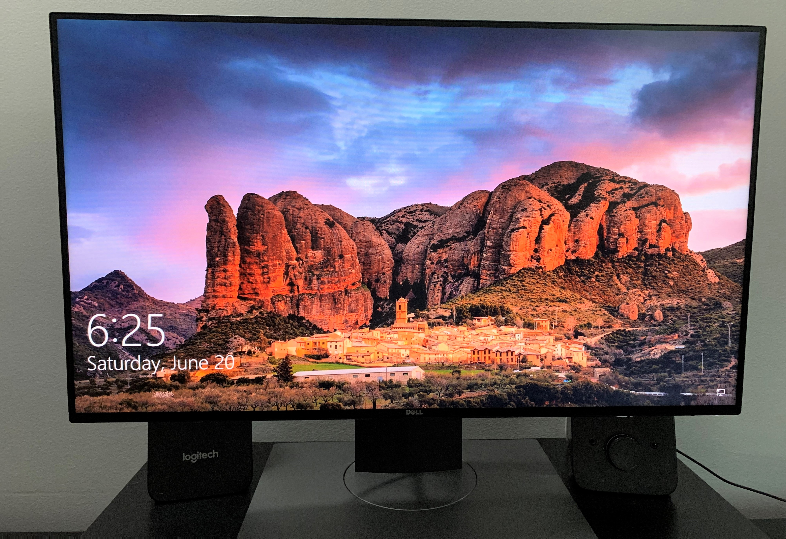
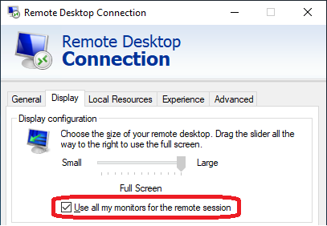
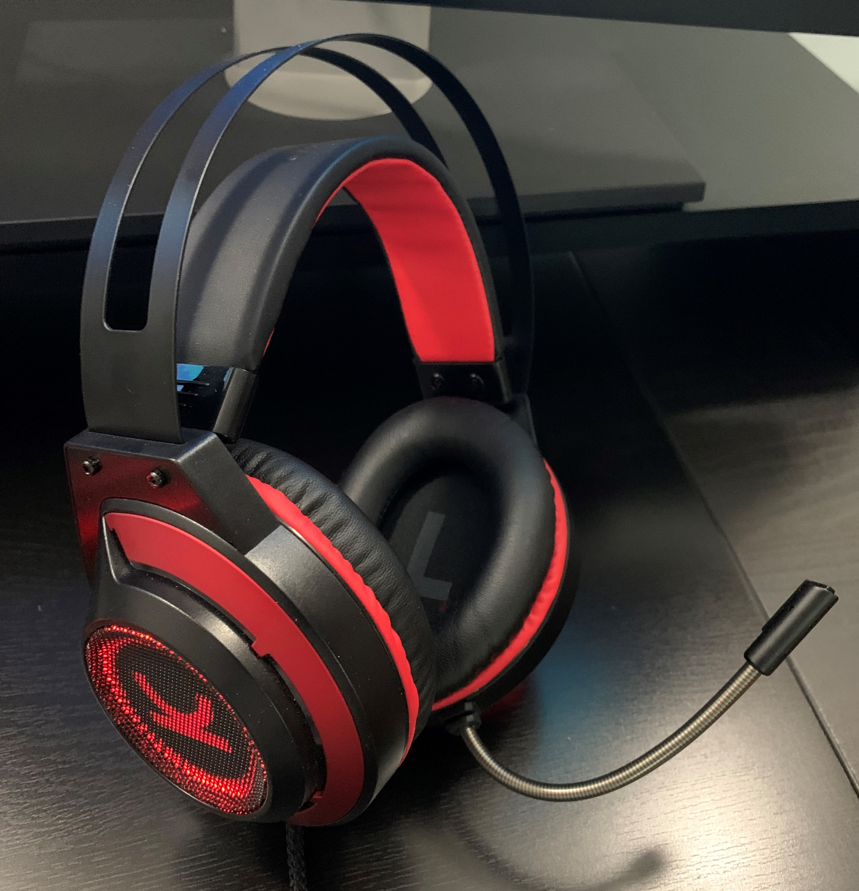
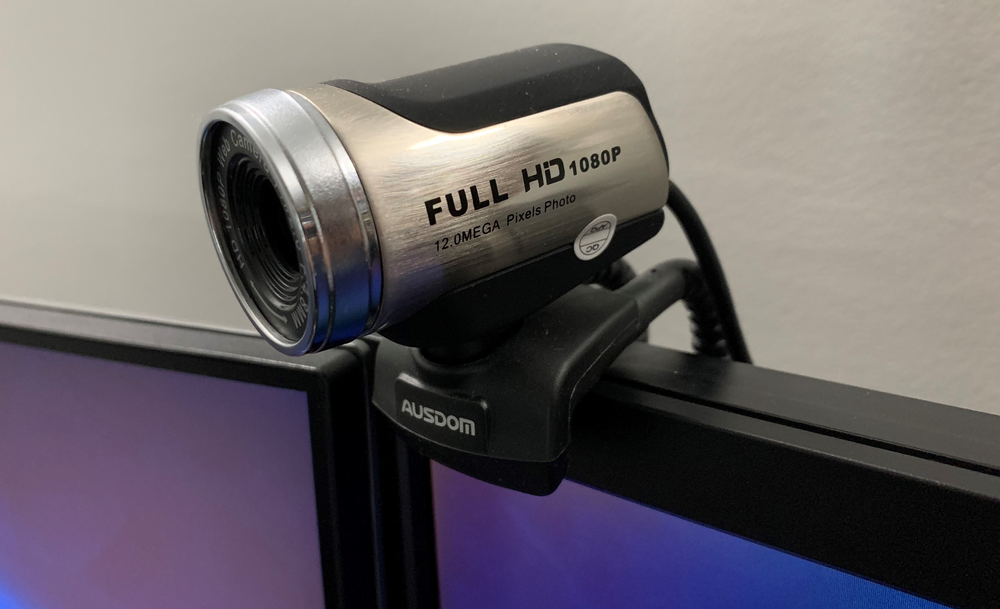
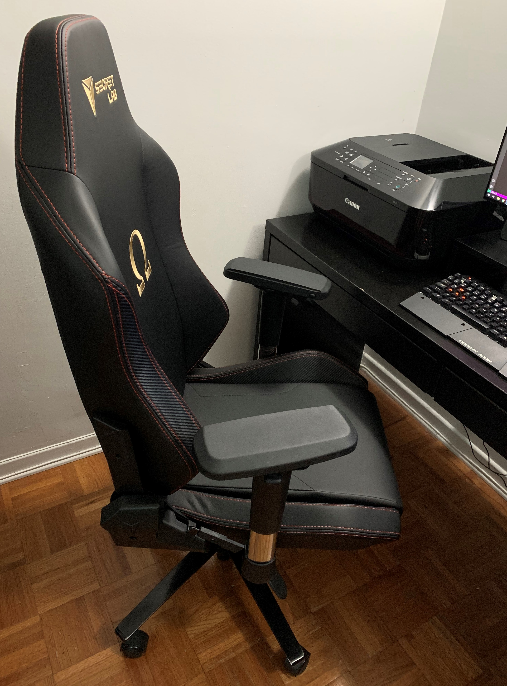

Like many others, I have been working from home since March 18th due to the COVID-19 pandemic. Fortunately, as a software developer, all my work can be done on a computer, remoting into the workstation in office. In the past, I had also worked from home occassionally so my VPN is already setup way ahead.

I thank my past self for building a good desktop PC (mostly for gaming though :satisfied:) which make the transition to fully *WFH* a lot more comfortable.

Most of my "gears" were shipped from Singapore when I moved to Montreal in 2017. I self-built this PC back in 2011, it's almost 10 years old. Over the years, I have upgraded/replaced many components except the CPU and motherboard.

- Intel Core i5-2400 CPU (Sandy Bridge)
- 24 GB DDR3 RAM
- Zotac GeForce RTX 2060 6GB GDDR6 Graphic Card
- Total 700 GB SSD 
- Total 7 TB HDD
- EVGA 650W fully modular PSU

For the displays, I have two Dell monitors with a [24" U2417H](https://amzn.to/3fK02Hs) pairing with an older 23" U2311H. Both are the *UltraSharp* series from Dell, using In-plane Switching (IPS) panels which make the color looks really great. I also prefer this type of stands which allow height adjustment.

:bulb: Tip: Workspace ergonomics suggests that the main monitor should be placed at the center with about an arm's length away from the body, instead of a `/\` shape.

:bulb: Tip: You can use both screens for Remote Desktop by checking the "Use all my monitors for the remote session" box.

To maximize space, I bought two [Fitueyes Monitor Risers](https://amzn.to/2V3zOYR) which not only allow me to set the monitors on eye level, but also to slot in the keyboard and mouse under it whenever I need more space.

For typing, I am using the [Cougar 600K Mechanical Gaming Keyboard](https://cougargaming.com/products/discontinue_keyboards/600k/). Its simple design takes away the unnecessary gaming function keys and gets the job done. It is using Cherry MX Blue mechanical switches so there is the unavoidable clicking sound during typing. (My Logitech G710+ keyboard with less noisy MX Brown switches is still stuck in the office, unfortunately :sweat:)

The mouse and headphones are two new additions to my setup, bought during this WFH period, to replace their predecessors which were not as comfortable. 

The [Logitech G203](https://amzn.to/2V6OTZt) has a simple design and works comfortably for my hand size. The side buttons are always a *must* to me because they allow me to easily navigate back and forward (in browser, explorer, IDE etc.). It also has a light that changes color (configurable).

The [Vankyo CM7000 Gaming Headset](https://amzn.to/3dkYv9n) has a noise-canceling microphone that is 360° adjustable. It allows me to speak much clearly during calls. As a plus point, it can also be plugged into a PS4 controller.

I don't usually turn on video during work calls but I do have an [Ausdom Full HD Webcam](https://amzn.to/2YUbr0P) sitting on top of the Dell U2311H monitor, ready to serve when needed. It also has a built-in microphone.

Last but not least, a very comfortable chair - the [Secretlab Omega Series](https://secretlabchairs.ca/collections/omega-series). Mine is the 2016 series bought in Singapore. It is made by a company founded in Singapore, and now they have expanded to Europe and North America.

I don't need my all-in-one Canon MX727 (seen in picture above) for work, but it is always useful when I need to scan and print documents.

WFH is going be the "new normal" for developers like us, and I am ready.

Now I just need a hair cut. :haircut_man:	